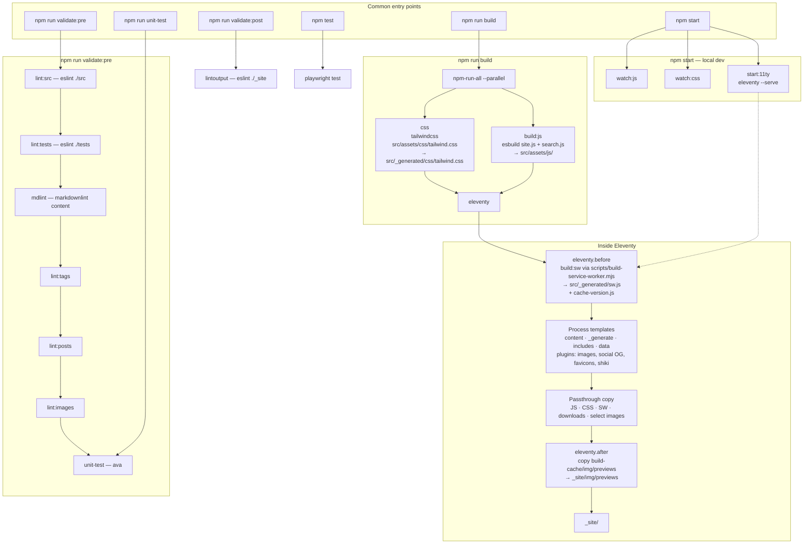
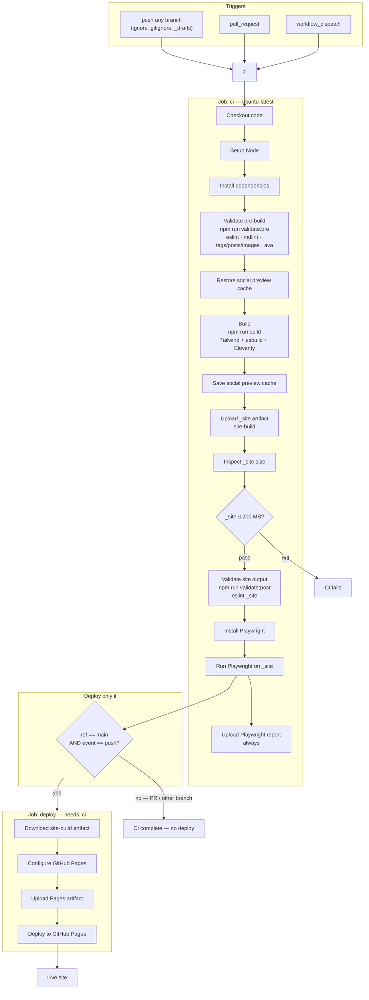

# deejaygraham.github.io

This is my Github user page that used to be made with Jekyll. It is now made using 11ty. If this page gets published at http://deejaygraham.github.io something has gone badly wrong.

## Start

Clone repo and run ./clean_start to prepare the dev environment. Runs ./check script at the end to run basic lint and tests.

## Validation

The markdown and javascript used in the site for building or at runtime are validated with several lint tools before building. 
./check script runs lints and unit tests to make sure everything looks good before committing.

## Build 

The site is built using [11ty](https://www.11ty.dev) and published here in glorious github.

## Workflow

GitHub Actions runs CI on every push and pull request. Deploy to GitHub Pages happens only after a successful CI run on a push to `main`.

## Test

Tests are split into two areas. Plain javascript - 11ty filters etc - is tested using the [ava](https://github.com/avajs/ava) test runner. End to end tests are 
done by [Playwright](https://playwright.dev) and are run on every push to main. One test is excluded - testing the clipboard copy - because I can't get it to 
work correctly in CI, it is available to run on a local build. 
